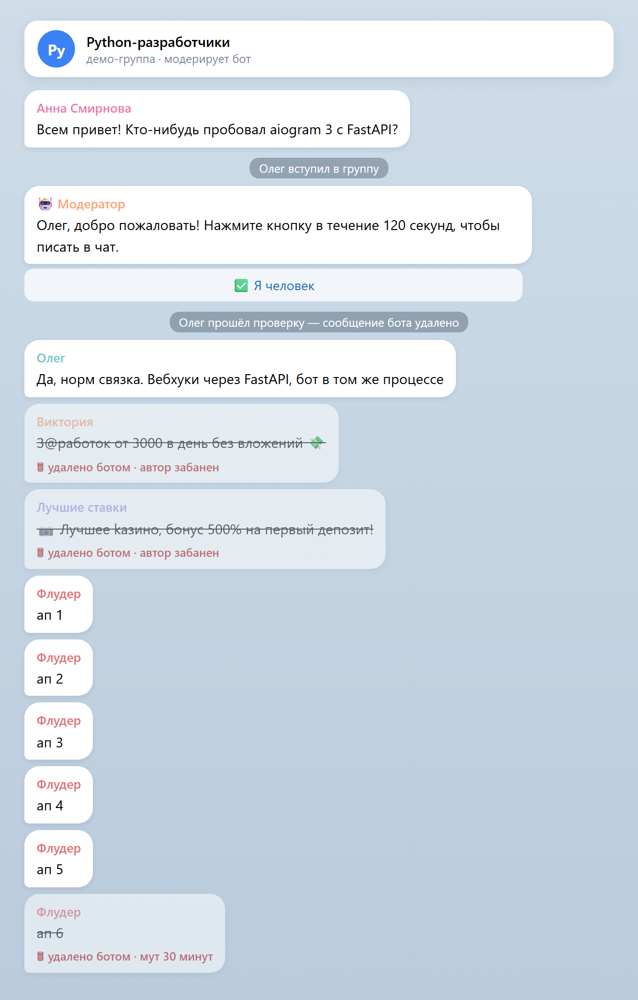
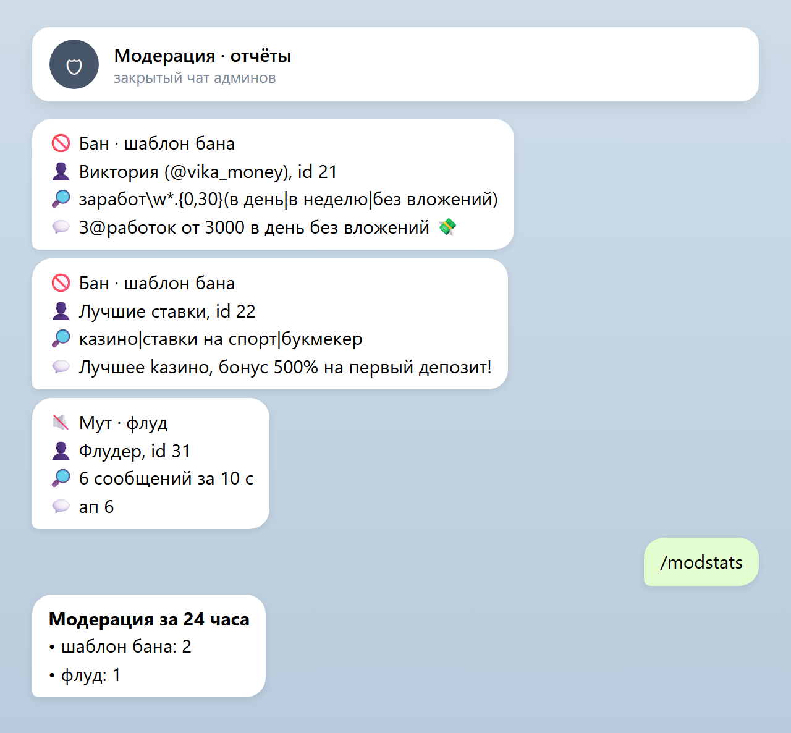
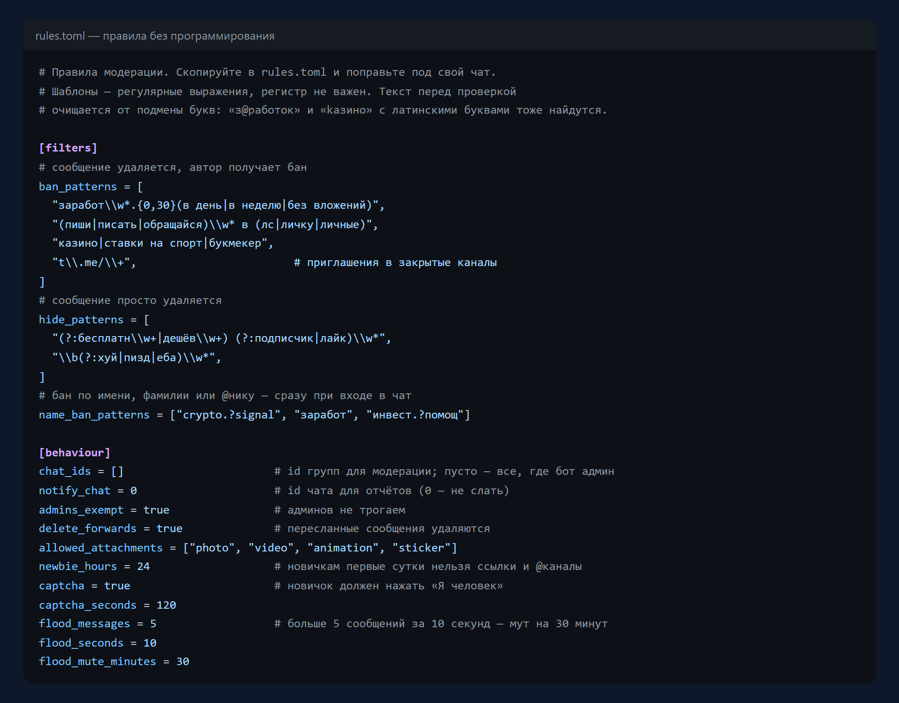
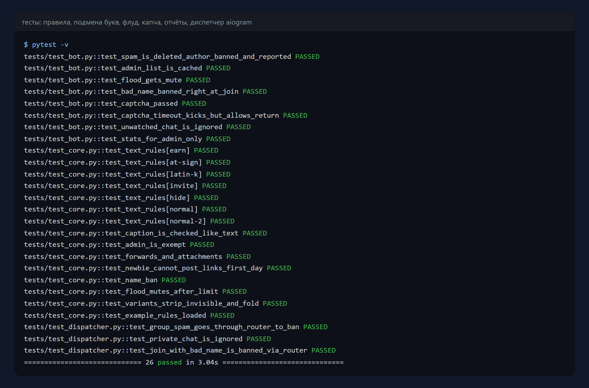

# Бот-модератор для Telegram-групп

Чистит группу от спама: удаляет и банит по шаблонам, ловит подмену букв
(«з@работок», «kазино» с латинской k), проверяет подписи к фото, банит
спам-аккаунты по имени прямо при входе, просит новичков нажать «Я человек»,
не даёт новичкам ссылки в первые сутки, глушит флуд и присылает отчёт о каждом
действии в закрытый чат админов. Правила — в одном TOML-файле, без программирования.

> Это возрождение заброшенного проекта
> [OriginProtocol/telegram-moderator](https://github.com/OriginProtocol/telegram-moderator)
> (115★, последние изменения — январь 2022). Оригинал написан на
> python-telegram-bot 9 образца 2018 года, а часть его зависимостей
> (`googletrans`) давно не работает. Код переписан на aiogram 3, идея и
> лицензия MIT сохранены.

Python 3.11+ · aiogram 3 · SQLite · pytest · Docker

| Группа | Отчёты админам |
|---|---|
|  |  |

## Что умеет

- **Шаблоны бана и скрытия** — регулярные выражения: сообщение удаляется, а при
  «бановом» шаблоне автор получает бан.
- **Защита от подмены букв** — перед проверкой текст нормализуется: латинские
  двойники ↔ кириллица, `@`→а, `0`→о, невидимые символы убираются.
- **Подписи к фото и видео** проверяются так же, как текст.
- **Бан по имени и нику** — сразу при входе в группу, а не когда спамер напишет.
- **Капча для новичков**: пока не нажмёт «Я человек», писать не может; не нажал
  вовремя — выгоняется (вернуться можно). Кнопка работает только для «своего» человека.
- **Новичкам без ссылок** первые N часов.
- **Антифлуд**: больше N сообщений за M секунд — мут на заданное время.
- **Пересланные сообщения и вложения** — по правилам (например, голосовые нельзя, фото можно).
- **Админы не трогаются**, их список кешируется на 5 минут.
- **Отчёт в чат админов** о каждом действии и `/modstats` — сводка за сутки.



## Что изменено по сравнению с оригиналом

**Переписано под современный стек:** python-telegram-bot 9 → aiogram 3,
PostgreSQL → SQLite по умолчанию, правила из десятка переменных окружения → один
файл `rules.toml`.

**Исправлены ошибки оригинала**
- в отчётах и журнале вместо текста печатались байты `b'\xd0…'` — пережиток Python 2;
- спам-аккаунт с запрещённым именем банился, только когда что-то напишет;
- после удаления пересланного сообщения проверки не останавливались и
  пытались удалить его повторно;
- подписи к фото и видео не проверялись вовсе;
- подмена похожих букв была только в планах (TODO в коде).

**Убрано**
- перевод сообщений через `googletrans` — библиотека не работает;
- оценка тональности через textblob — к модерации не относится;
- команда `/price` для криптотокена компании-автора;
- запись всей переписки группы в базу. Теперь журналируются только действия
  модератора — меньше лишних персональных данных.

**Добавлено:** капча, ограничение ссылок для новичков, антифлуд,
`/modstats`, Docker, 26 тестов.

## Запуск

```bash
pip install -r requirements.txt
cp rules.example.toml rules.toml      # и поправьте под свой чат
BOT_TOKEN=123:abc python -m moderator
```

Бота нужно сделать админом группы с правами удалять сообщения и блокировать
участников, а в @BotFather выключить privacy mode (`/setprivacy` → Disable),
иначе бот не видит обычные сообщения.

Docker: `docker build -t moderator . && docker run -d -e BOT_TOKEN=... -v mod:/data moderator`

## Тесты

```bash
pytest -v
```

Все правила, подмена букв, флуд, капча (прошёл, нажал чужой, не успел),
кеш админов, отчёты и сквозные тесты через настоящий `Dispatcher` aiogram с
подменённой сетью Telegram — 26 тестов.



## Лицензия

MIT, как у оригинала. Оригинальный проект — [Origin Protocol](https://github.com/OriginProtocol).
